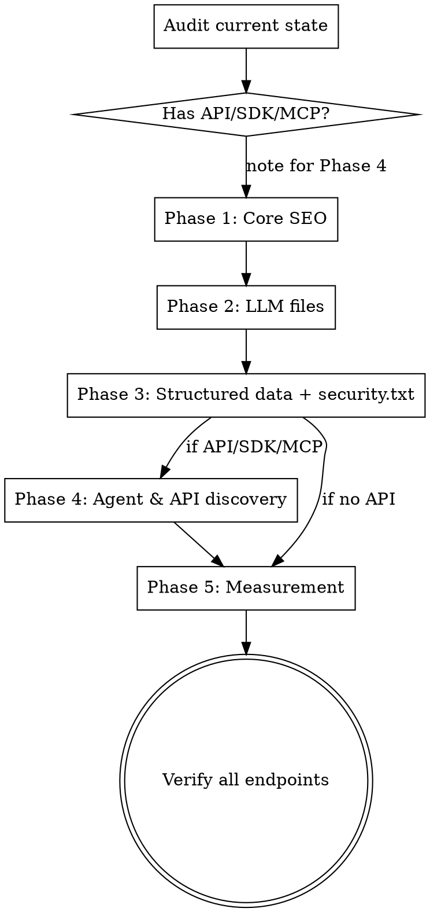

# LLM SEO & AI Agent Discoverability

Add files, metadata, and content patterns that help AI agents, LLM crawlers, and AI-powered search engines discover, understand, recommend, and integrate with a website or developer tool.

## Workflow



### Audit

Before implementing, detect the project context:

**Framework detection:**
- Primary: Next.js (`next.config.*`). Examples use Next.js conventions (`robots.ts`, `sitemap.ts`, route handlers).
- Astro: endpoints at `src/pages/llms.txt.ts`. SvelteKit: `src/routes/llms.txt/+server.ts`. Nuxt: `server/routes/llms.txt.ts`. Static sites: place files in static/public directory.

**Check existing infrastructure:**
- `public/` folder for robots.txt, sitemap, favicon, manifest
- Root layout for metadata (metadataBase, OG, Twitter, icons)
- Any JSON-LD structured data
- Any `.well-known/` files

**Detect API/SDK/MCP presence** (determines if Phase 4 applies):
- OpenAPI spec or API routes (`/api/`)
- MCP server package or configuration
- SDK package (e.g., `@product/sdk`)
- If any exist → Phase 4 applies

### Phase 1: Core SEO Infrastructure

1. **robots.ts** — Crawl rules allowing AI bots on public pages, blocking dashboard/internal routes. See [file-formats.md](references/file-formats.md#robotstxt-ai-crawlers) for the full AI crawler list (GPTBot, ClaudeBot, Claude-SearchBot, PerplexityBot, OAI-SearchBot, Google-Extended, BingBot, and others).

2. **sitemap.ts** — XML sitemap with public pages. Set `priority` (1.0 for landing, 0.8 for docs) and `lastmod`. Include `/llms.txt` at priority 0.6.

3. **Root metadata expansion** — `metadataBase`, `title` with template, rich `description`, `openGraph`, `twitter` cards, `icons`, `keywords`. See [file-formats.md](references/file-formats.md#opengraph--twitter-cards). The `<title>` tag is the only metadata reliably reaching AI (5/6 in testing) — make titles descriptive and keyword-rich.

4. **Per-page metadata** — Each public page exports its own metadata with specific title/description. Use definitional language in descriptions ("X is..." not "X helps you...").

### Phase 2: LLM Text Files

5. **`/llms.txt`** — Concise Markdown overview (~1-2KB): what the product does, use cases, developer platform links, pricing. See [file-formats.md](references/file-formats.md#llmstxt-format).

   **Critical: Include an "Instructions for LLMs" section** (the Stripe pattern). This is the highest-impact element — it actively steers AI toward current best practices and away from deprecated patterns. See [file-formats.md](references/file-formats.md#instructions-for-llms-section) for the template.

6. **`/llms-full.txt`** — Complete reference: all features, API endpoints, MCP tools, SDK examples, auth guide, rate limits. If an OpenAPI spec or MCP tool registry exists, generate dynamically to stay in sync.

**Implementation:** Use route handlers (not static files) returning `text/plain`. For non-Next.js: use framework-equivalent dynamic routes, or static files if content is stable.

### Phase 3: Structured Data (JSON-LD)

7. **Extract shared content** — Move data used by both UI and structured data (FAQs, pricing) to shared modules.

8. **Reusable JsonLd component** — Simple component rendering `<script type="application/ld+json">`.

9. **Landing page schemas** — Use "Triple Schema Stacking" (multiple JSON-LD blocks per page). Priority schemas:
   - **Organization** — company info, logo, URL
   - **SoftwareApplication** — app metadata, pricing, category
   - **FAQPage** — FAQ sections (very high AI citation value)
   - **WebSite** — site-level info
   - **Speakable** — mark 2-3 most important content sections as priority for AI retrieval
   - **HowTo** — tutorial/guide pages
   - **TechArticle** — documentation pages

   See [file-formats.md](references/file-formats.md#json-ld-schemas) for schema examples.

10. **Content optimization** — Structure page content for AI citation. See [geo-content-strategy.md](references/geo-content-strategy.md) for definitional openings, quotable language, freshness signals, and E-E-A-T patterns.

### Phase 3b: Security & Contact (all projects)

11. **`/.well-known/security.txt`** — RFC 9116 security contact info. See [file-formats.md](references/file-formats.md#securitytxt-format).

### Phase 4: Agent & API Discovery (conditional)

*Skip if the project has no API, SDK, or MCP server.*

12. **Public OpenAPI endpoint** — Unauthenticated endpoint serving the OpenAPI spec. Write rich, semantic descriptions for every operation — AI agents use these to decide whether to call your API. Include examples in schemas. Use meaningful `operationId` names.

13. **Agent discovery files:**
    - `/.well-known/agent-card.json` — A2A protocol metadata (identity, capabilities, auth, skills). Growing adoption via Google/Linux Foundation. See [file-formats.md](references/file-formats.md#a2a-agent-card).
    - `/.well-known/ai-plugin.json` — Legacy OpenAI plugin manifest. Still recognized by some tools. See [file-formats.md](references/file-formats.md#ai-pluginjson-manifest-legacy).

14. **Registry & indexing registration:**
    - **MCP Registry** — Register at `registry.modelcontextprotocol.io` if project has an MCP server
    - **PulseMCP / Smithery** — List on these directories for broader discovery
    - **Context7** — Submit at `context7.com/add-library` or add `context7.json` to repo for AI coding assistant indexing. See [file-formats.md](references/file-formats.md#context7json-config).

### Phase 5: Measurement & Monitoring

15. **AI referrer tracking** — Set up GA4 custom channel group for AI traffic (chat.openai.com, chatgpt.com, perplexity.ai, claude.ai, copilot.microsoft.com). See [analytics-and-measurement.md](references/analytics-and-measurement.md) for full tooling, KPIs, and monitoring cadence.

## Quick Reference

| File | Location | Content-Type | Purpose | Conditional |
|------|----------|-------------|---------|-------------|
| robots.txt | `/robots.txt` | text/plain | AI crawler rules | No |
| sitemap.xml | `/sitemap.xml` | application/xml | Page index | No |
| llms.txt | `/llms.txt` | text/plain | Concise LLM overview + instructions | No |
| llms-full.txt | `/llms-full.txt` | text/plain | Complete LLM reference | No |
| JSON-LD | Inline in HTML | application/ld+json | Structured data | No |
| security.txt | `/.well-known/security.txt` | text/plain | Security contacts | Recommended |
| OpenAPI spec | `/api/openapi/public` | application/json | API definition | API only |
| agent-card.json | `/.well-known/agent-card.json` | application/json | A2A agent metadata | API/MCP only |
| ai-plugin.json | `/.well-known/ai-plugin.json` | application/json | Plugin manifest (legacy) | API only |
| context7.json | Repo root | application/json | AI docs indexing config | SDK/lib only |

## Common Mistakes

| Mistake | Fix |
|---------|-----|
| No "Instructions for LLMs" in llms.txt | Add Stripe-style section steering AI toward current patterns and away from deprecated ones |
| Static llms.txt that drifts from API | Generate dynamically from OpenAPI spec / MCP registry |
| Blocking all AI crawlers in robots.txt | Allow on public pages, block only private routes |
| Duplicating FAQ data in component and JSON-LD | Extract to shared module, import in both |
| No `metadataBase` set | Set it — required for absolute URL composition in OG/Twitter |
| Missing Speakable schema | Mark key content sections for AI retrieval priority |
| Single JSON-LD block per page | Use Triple Schema Stacking — multiple schemas per page |
| Not registered on MCP Registry / Context7 | Register for maximum AI agent discoverability |
| Content not optimized for AI citation | See [geo-content-strategy.md](references/geo-content-strategy.md) |
| No AI referrer tracking | Set up GA4 channel group for AI traffic sources |
| No cache headers on discovery endpoints | Add `Cache-Control: public, max-age=86400` |

## Verification

After implementing, verify each endpoint:
```bash
curl -s $URL/robots.txt | head -20
curl -s $URL/sitemap.xml | head -5
curl -s $URL/llms.txt | head -20
curl -s $URL/llms-full.txt | wc -l  # Should be significantly longer than llms.txt
curl -s $URL/.well-known/security.txt
# If API/SDK/MCP:
curl -s $URL/.well-known/agent-card.json | jq .name
curl -s $URL/.well-known/ai-plugin.json | jq .name_for_model
curl -s $URL/api/openapi/public | jq .openapi
# Check HTML source for:
# - Multiple JSON-LD script blocks (Triple Stacking)
# - Speakable schema
# - OG and Twitter meta tags
# - Descriptive <title> tags
```

## Future Standards (Monitor)

- **WebMCP** — W3C initiative (Google + Microsoft). Exposes structured tools to browser AI agents via `navigator.modelContext`. Chrome Canary preview available. Native browser support expected H2 2026.
- **`/.well-known/mcp.json`** — MCP server cards for automated discovery (SEP-1649, SEP-1960). Implement when spec stabilizes.
- **Arazzo specs** — Multi-step API workflow orchestration for complex agent integrations.
- **Dynamic OG images** — Framework-generated social preview images for shared content pages.
